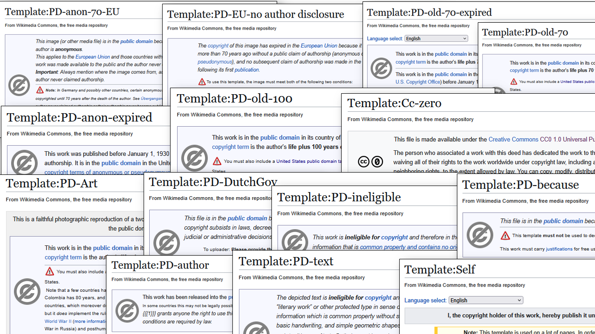
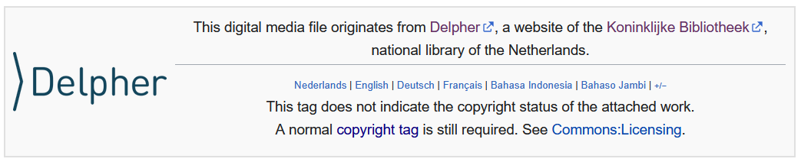

<table width="100%" border="0"><tr><td align="left">
<a href="https://kbnlwikimedia.github.io/stories/"><< Back to stories index</a>
</td><td align="right">
<a href="https://github.com/KBNLwikimedia/wikimedia-commons_copyright-templates" target="_blank">>> To the Github repo of this page</a>
</td></tr></table>

# Free to use? Exploring public domain claims in Wikimedia Commons files sourced from Delpher (May 2025)
Olaf Janssen, xx May 2025

This article is also [available as PDF](ongithub.pdf).

_**[Delpher](https://www.delpher.nl)** offers access to millions of digitized pages from Dutch historical newspapers, books, and magazines — a valuable resource frequently used on Wikimedia Commons. In the first part of this data story, we examine how the Wikimedia community has assigned public domain status to Commons files that have been [sourced from Delpher](https://commons.wikimedia.org/wiki/Category:Media_from_Delpher).  
In the second part, we explore the validity of these claims and assess whether they align with the actual copyright status of the works. We identify common mistakes made by the Wikimedia community when applying public domain templates to files. Finally, we examine whether these errors have resulted in any serious copyright violations._

## Key figures and findings
The most important key figures and findings of this story are:
* kf 1
* kf 2
* kf 3
* 

## Intro, preamble, and background

### Why did I write this article? 
Much of the historical content from Delpher falls into the public domain due to its age and can therefore be uploaded to Wikimedia Commons without concern. At the same time, the KB — being the operator of Delpher — has a contractual obligation towards authors and publishers to monitor potential copyright infringements and to prevent them as much as possible, including Delpher content that has been uploaded to Wikimedia Commons by the Wikimedia contributors.

For this reason, the KB wants to gain a better understanding of which newspaper articles, books, magazines and other materials from Delpher have been uploaded to Wikimedia Commons, and how public domain claims to those files have been assigned by the Wikimedia community. In doing so, it is important to emphasize that the KB has absolutely **no** intention to act as a copyright police force. The goal is to work together with the Wikimedia community to handle copyright matters responsibly, with respect for both creators and users.

### What this article aims to do
1. Provide a **practical case study** of how public domain claims are applied in a real-world environment — specifically, how Wikimedia Commons contributors handle copyright claims for [files sourced from Delpher](https://commons.wikimedia.org/wiki/Category:Media_from_Delpher).
2. Offer insight into the **complexity of public domain claims** on Wikimedia Commons — even for the relatively simple case where files originate from a single source (Delpher) from a single country (the Netherlands).
3. Explore **how accurately Wikimedia contributors apply public domain claims**, and assess to what extent potential copyright violations may occur — including whether serious violations are present.
4. Share a **practical data story** of how to machine-analyze and visualize copyright claims for files in (subsets of) Wikimedia Commons using data analysis and visualization techniques.  

### What this article does <u>not</u> aim to do
1. Provide a **comprehensive overview of all public domain claims** on Wikimedia Commons. This article focuses specifically on files sourced from Delpher, which is a manageable subset of the total number of files in Commons.
2. Provide a **formal and/or detailed legal analysis** of every public domain claim for these files — such an approach would be far too deep for the scope of this data story.
3. XXXXXXXXX **Identify and flag every potential copyright infringement** — aside from highlighting a few obvious and illustrative cases mentioned later in this story. XXXXXXXXXXXX (besides the 5 obvious cases mention below)
4. Offer **recommendations or proposals on how to simplify public domain claims** on Wikimedia Commons. This article takes the current public domain landscape "as is," observing how it functions in practice without suggesting reform.

### Who is this article relevant for? 
This analysis of public domain template usage on Wikimedia Commons applied to files sourced from Delpher may be of interest to:
* **The Wikimedia community** – to gain insights into how (accurately) they have implemented public domain copyright templates, especially for Delpher-sourced files.
* **The Delpher development team and user community** – to better understand how a decentralized, international community of content reusers deals with public domain Delpher-sourced materials in a real-world scenario, i.e. on Wikimedia Commons.
* **Other GLAM institutions with collections on Wikimedia Commons** – to explore how this Delpher case study could be replicated for their own Wikimedia Commons files, supported by the freely available code, data and documentation shared via this article.
* **KB copyright lawyers and the wider legal/copyright community** – to see how copyright law and public domain issues play out in a real-world, community-driven environment, and to reflect on the practical implications for heritage institutions like the KB.
* **Rights holders, publishers and collective rights organizations** – to assess whether there should be reasons for serious concern about large-scale copyright violations by the Wikimedia community (spoiler: our findings suggest there is little to no cause for such concern).

## Copyrights templates in Wikimedia Commons

[Wikimedia Commons](https://commons.wikimedia.org/) is one of the largest open-access media repositories in the world, used daily by Wikipedia and countless other businesses and projects. To protect the open and reusable nature of its content, strict legal rules must be followed for files that are uploaded to Commons:  

1) All uploaded files must either be:  
   - Out of copyright — meaning they are in the public domain, either passively [because copyrights have expired](https://gowlingwlg.com/en/insights-resources/articles/2024/public-domain-what-happens-when-copyright-expires), or because the rights holders have waived any copyrights on the files, actively releasing them into the public domain, for instance by using a [CC0 license](https://creativecommons.org/public-domain/cc0/).  
   - Freely licensed — under licenses that allow reuse and modification, most commonly [CC-BY](https://creativecommons.org/licenses/by/4.0/), [CC-BY-SA](https://creativecommons.org/licenses/by-sa/4.0/), or equivalent.

2) These copyright claims must be explicitly and unambiguously added to the file description page.
See for instance the [public domain claim](https://commons.wikimedia.org/w/index.php?title=File:1923_Jos._Schrijnen_%E2%80%94_MMKB02_000118508_00004_image_(cropped).jpg&action=edit&section=2) stated in [this portrait](https://commons.wikimedia.org/wiki/File:1923_Jos._Schrijnen_%E2%80%94_MMKB02_000118508_00004_image_(cropped).jpg) made by the Dutch photograhper [Toni Arens-Tepe](https://nl.wikipedia.org/wiki/Toni_Arens-Tepe) (1883–1947).
 
3) These claims are typically expressed through standardized copyright templates (also known as *license tags*). These templates are meant to ensure clarity, uniformity and standardization when declaring copyright status of files. Templates on Commons can be recognized by the double curly brackets they are called by, for instance 
   - [\{\{PD-old-70\}\}](https://commons.wikimedia.org/wiki/Template:PD-old-70) — The file is in the public domain because the creator of the underlying work died more than 70 years ago.  
   - [\{\{CC-BY-SA-4.0\}\}](https://commons.wikimedia.org/wiki/Template:Cc-by-sa-4.0) — Creative Commons Attribution-ShareAlike 4.0 license.  
   - [\{\{PD-ineligible\}\}](https://commons.wikimedia.org/wiki/Template:PD-ineligible) — The file is in the public domain because it (and/or its underlying work) lacks sufficient originality to be eligible for copyright protection. 

### The copyright template jungle   

But here’s the problem: although the purpose of these templates is to provide a clear and standardized way to declare copyright status, the practical reality is that the license tagging system — built over the years by the international Wikimedia community — has evolved into a very complex thing. The number of different copyright templates in use on Commons is enormous.

To get a sense of this complexity, take a look at [this summary of the most common template types](https://commons.wikimedia.org/wiki/Commons:Copyright_tags) or explore this nested [overview of several thousands(!) of copyright templates](https://commons.wikimedia.org/wiki/Category:License_tags) being used on Commons.

Both insiders and outsiders will struggle to find their ways in this system, it can feel like working through a jungle of overlapping licensing options and confusing terminology, undermining the intended simplicity and standardization.

However, this complexity is not entirely surprising. Wikimedia Commons accepts media from any country, any jurisdiction and any historical period, and must therefore be able to handle the copyright rules and exceptions from dozens of legal systems worldwide. This elaborate system is necessary because Wikimedia Commons is a global, evolving platform. Templates are regularly added or updated as contributors find new sources for uploads or as local copyright regulations change.

## Zooming in: public domain templates in Wikimedia Commons
To somewhat trim down this jungle, we can narrow the scope and look only at public domain templates, used for files that are out of copyright. Yet even within this limited scope, things remain complicated, as the number and variety of such templates is still pretty large.

The [General public domain templates](https://commons.wikimedia.org/wiki/Commons:Copyright_tags/General_public_domain) page provides an overview of more than 70 templates based on general criteria, not tied to a specific country or source of the work. The complexity becomes more apparent when examining the [Category:PD license tags](https://commons.wikimedia.org/wiki/Category:PD_license_tags) and its subcategories. These include numerous [country-specific public domain templates](https://commons.wikimedia.org/wiki/Commons:Copyright_tags/Country-specific_tags), each reflecting the legal nuances of copyright legislation in the country of origin.

Adding to this complexity is a crucial requirement: *Every file on Wikimedia Commons must also include a justification for its public domain status under U.S. law.* This requirement arises from the fact that Wikimedia’s servers are located in the United States. Therefore, all hosted content must comply not only with the copyright laws of the country of origin but also with those of the U.S., which [can be particularly intricate](https://guides.library.cornell.edu/copyright/publicdomain) and often differ substantially from other jurisdictions.

In practice, this means that many Commons files require multiple templates: 
* One or more templates describing the copyright status in the country of origin;
* An additional template confirming the file's public domain status in the United States.

 *A (non-exhaustive) collage of screenshots of public domain template description pages, as used in Wikimedia Commons [files that have been sourced from Delpher](https://commons.wikimedia.org/wiki/Category:Media_from_Delpher) (Click to enlarge). Image license: <a href="https://creativecommons.org/licenses/by-sa/4.0/deed.nl" target="_blank">CC-BY-SA 4.0</a> / Olaf Janssen, KB national library of the Netherlands.*

=============== tot hier gekommmen met schrijven =======================

##  Zooming in further: licensing templates used in Delpher fioles

## Creating the dataset

The Wikimedia community has been uploading newspaper articles, advertisements, obituaries, book pages, portraits from magazines, and other materials from Delpher (and its predecessor projects) to Wikimedia Commons [since March 2008](https://commons.wikimedia.org/wiki/File:Krantenartikel_Tentoonstelling_De_Branding.jpg). Because these files were originally scattered across Commons without consistent categorization, the first step was to bring them together into a single, central place: [Category:Media from Delpher](https://commons.wikimedia.org/wiki/Category:Media_from_Delpher). 
This category currently contains just over over 62K files. 

**Delpher source template** 
We added a [\{\{Delpher\}\} source template](https://commons.wikimedia.org/wiki/Template:Delpher) to all of these files ([example](https://commons.wikimedia.org/w/index.php?title=File:1863_Commissie_tot_de_Vervoermiddelen_op_Java_1863.jpg&action=edit)). This is not only to visually and textually communicate that Delpher is the source of these files, but also to automatically include the files into the said category. 

 *A screenshot of the rendered [Delpher source template](https://commons.wikimedia.org/wiki/Template:Delpher) on Wikimedia Commons.*

**Excluding scans from the Internet Archive** 
As you can see in the category, a significant part is filled with files claimed to be uploaded from the Internet Archive, but that find their real origins in Delpher. These are the PDFs with *IA ddd ...mpeg21* in their titles ([example](https://commons.wikimedia.org/wiki/File:%27s_Gravenhaagsche_courant_02-09-1822_(IA_ddd_010124645_mpeg21).pdf)). In total there are [55,761 files from the Internet Archive](https://petscan.wmcloud.org/?templates_yes=&ores_prob_from=&search_query=&edits%5Bflagged%5D=both&show_disambiguation_pages=both&common_wiki_other=&wikidata_prop_item_use=&edits%5Banons%5D=both&combination=subset&larger=&min_sitelink_count=&language=commons&manual_list_wiki=&search_max_results=500&edits%5Bbots%5D=both&project=wikimedia&rxp_filter=&negcats=&cb_labels_no_l=1&since_rev0=&sparql=&ores_type=any&links_to_any=&outlinks_no=&sitelinks_yes=&langs_labels_yes=&output_compatability=catscan&sitelinks_no=&categories=Scans_from_the_Internet_Archive%0D%0AMedia+from+Delpher&min_redlink_count=1&interface_language=en&cb_labels_any_l=1&pagepile=&cb_labels_yes_l=1&ores_prob_to=&format=html&wikidata_source_sites=&labels_any=&ns%5B6%5D=1&smaller=&doit) (d.d. 9 April 2025) that were originally sourced from Delpher. 

All of these files are marked with the [\{\{PD-old-70-expired\}\} copyright template](https://commons.wikimedia.org/wiki/Template:PD-old-70-expired), which means that they are safely in the public domain in the Netherlands (and its predecessors), the rest of the EU and the United States. 

Because such a large part - 89.6% of the files - in the [Category:Media from Delpher]((https://commons.wikimedia.org/wiki/Category:Media_from_Delpher)) come from the Internet Archive, we decided to exclude them from our further analysis. And because all of them are marked with the exact same copyright template, including them would make our analysis too biased (or skewed) towards these files and templates.

**Extracting copyright templates** 
This left us with [6,496 'non-Internet Archive' files from Delpher](https://petscan.wmcloud.org/?templates_any=&language=commons&combination=subset&search_max_results=500&langs_labels_yes=&cb_labels_no_l=1&negcats=Scans+from+the+Internet+Archive&format=html&project=wikimedia&cb_labels_yes_l=1&pagepile=&before=20250409&active_tab=tab_pageprops&links_to_all=&min_sitelink_count=&interface_language=en&min_redlink_count=1&only_new=on&ns%5B6%5D=1&sitelinks_any=&categories=Media+from+Delpher&cb_labels_any_l=1&wikidata_source_sites=&rxp_filter=&langs_labels_any=&manual_list_wiki=&doit=). For these files, we wanted to extract the associated copyright templates. With some help from ChatGPT, we developed a (rather monsterous) [Python script](../scripts/extract_copyright_templates.py) to extract public domain or public domain-like license templates (e.g., Creative Commons). This script was not 100% perfect, some manual post-processing was needed to clean up the data.

**Excluding files without publication/creation dates** 
As we plan to assess the validity of copyright claims against the actual publication or creation dates of the underlying works, we also designed the script to extract simplified date information. Files that provided no publication or creation dates were excluded from further analysis. We will discuss the date extraction process in more detail in SECTIONXXXXXXXXXXXXXXXXXXX.

**The final dataset** 
In the end, we were able to retrieve 6,248 distinct files that contained both (one or more) copyright templates and a publication or creation date. This is the [dataset used in our further analysis](link to Excel). XXXXXXXXXXXXX

## Section 2: Tracking the copyright templates in Wikimedia Commons, for Media from Delpher Delpher
Zoom in on Categortry: Media from Delpher Delpher

## Section 3 

<noscript></noscript>

After having done the scan, from the Excel, we could quite ealiy look for opublications that possibly did copyvio, based on the yerar of publication. We looked for content that was published in the last 70 years, and that still was marked as public domain or under CC-licensing. We found 4 files that were published in the last 70 years (after 1955), but that were marked as public domain or under CC-licensing.In total 4 deletion trequerst due to copyvio, all of which were granted and the fielswere deleted very quicly. 

* [De Telegraaf, 1985](https://commons.wikimedia.org/w/index.php?title=File:Newspaper_article_-_De_Telegraaf_-_Date_09-07-1985_-_Bank_robbery_-_Rob_Kaman_-_Kickboxing.jpg&action=edit&redlink=1)
This is a file from Dutch newspaper 'De Telegraaf' from 1985, this article is still under copyright, as it was published less than 70 years ago. I cannot have a CC0 license

* [Trouw, 1974](https://commons.wikimedia.org/w/index.php?title=File:Advertentie_Pottenbakkerij_Henk_en_Lieske_Potters_in_Trouw_dd_22_maart_1974.jpg&action=edit&redlink=1)
This is a file from Dutch newspaper 'Trouw' from 1974. This article is still under copyright, as it was published less than 70 years ago. So we must assume that the copyright of this publication is with the newspaper publisher, unless proven otherwise.) 

* [Algemeen Dagblad, 1966](https://commons.wikimedia.org/w/index.php?title=File:Ad_25_6_1966.jpg&action=edit&redlink=1)
This is a file from Dutch newspaper 'Algemeen Dagblad' from 1966. This article is still under copyright, as it was published less than 70 years ago. So we must assume that the copyright of this publication is with the newspaper publisher, unless proven otherwise. Futhermore, it can not have a CCO license.

* [Het Binnenhof en Het Vaderland, 1956](https://commons.wikimedia.org/w/index.php?title=File:Een_oproep_van_Duco_Sickinghe_(1888-1983)_in_dagblad_Het_Binnenhof_en_Het_Vaderland_(1956).jpg&action=edit&redlink=1)
his is a text by Duco Sickinghe in a Dutch newspaper from 1956. According to Dutch coppyright law, this article is still under copyright, as the author only died in 1983 AND the article was published less than 70 years ago. So we must assume that the copyright of this publication is still with the (heirs of the) author or with the newspaper publisher, unless proven otherwise. Futhermore, it can not have a CC-BY license

><big><b><em>Quote 1</em></b></big>

><big><b><em>Quote 2</em></b></big>

### Section 2.1 

Explan which templates have been found

<noscript></noscript>

xxxxxxxxxxxxxxxxxxxxxxxxxxxxxxxxxxxxxxxxxxx

<noscript></noscript>

<!-- 
  -->

### Section 2.1 - Zooming in on copyrights expired because of age 

Next., lets';s zoom in on the copyright templates that are used for files that are in the public domain because of age. The blue colors.
 In total theis comprises 24 templates 6191 used in xx distinct files

<noscript></noscript>

## Section 3 Compliance of the community to the copyrights stramtrwents
Are thre any violations of big mistakes?

forthe "pd becauase of age groop" (98% of uses) we will llok at the year in which the orginalwork was published or creaed (column F "DateOfPublicationOrCreation" in the Excel)

- The years of publication or creation have been extrachred from the Wikitext, typically the "Date-field"
- for most fies the date could be extracted as a single year, for instance files taken from newspapers that were published in [1863](https://commons.wikimedia.org/wiki/File:1863_03_14_De_Spoorbrug_te_Venlo.jpg), [1926](https://commons.wikimedia.org/wiki/File:Nieuwe_Venlosche_Courant_vol_064_no_185_obituary_m%C3%A8re_Louise_Hanrath.jpg) or [1952](https://commons.wikimedia.org/wiki/File:Portret_van_Eug%C3%A8ne_Brands,_1952.jpg).
- In case this date was not a single year the latest/most recent year has been taken. For isntance [1920s]() *(--> YYYY)* , [before 1880]() *(--> YYYY)* or [circa 1949]()*(--> YYYY)*.  

Interesting cases to study, in the Excel 
* Files classified ""Copyrights waived or made free""
* Fioles from publ;ications 1955 or later that are marked as public domain

Make Datarwapper for trhat
https://commons.wikimedia.org/wiki/File:Proclamatie1955-Amigoe.jpg	File:Proclamatie1955-Amigoe.jpg	M147748690	Klik	1	1955	{{PD-anon-70-EU}}	https://commons.wikimedia.org/wiki/Template:PD-anon-70-EU	Klik	Copyrights expired because of age
https://commons.wikimedia.org/wiki/File:1957_Foto-album_van_burgemeester_P.M.J.S._Cremers%2C_1957_18.jpg	File:1957_Foto-album_van_burgemeester_P.M.J.S._Cremers,_1957_18.jpg	M150325640	Klik	1	1957	{{Cc-by-4.0}}	https://commons.wikimedia.org/wiki/Template:Cc-by-4.0	Klik	Copyrights waived or made free
https://commons.wikimedia.org/wiki/File:Hindeloopen_vlag_1650.svg	File:Hindeloopen_vlag_1650.svg	M81840054	Klik	1	1957	{{PD-self}}	https://commons.wikimedia.org/wiki/Template:PD-self	Klik	Copyrights waived or made free
https://commons.wikimedia.org/wiki/File:Handtekening_George_van_den_Bergh.jpg	File:Handtekening_George_van_den_Bergh.jpg	M89816821	Klik	1	1960	{{PD-signature}}	https://commons.wikimedia.org/wiki/Template:PD-signature	Klik	Not eligible for copyrights due to lack of sufficient originality
https://commons.wikimedia.org/wiki/File:Expositie_van_18_jonge_Nederlandse_striptekenaars_in_Kunstcentrum_Lijnbaan%2C_1971.jpg	File:Expositie_van_18_jonge_Nederlandse_striptekenaars_in_Kunstcentrum_Lijnbaan,_1971.jpg	M112239095	Klik	1	1971	{{Cc-zero}}	https://commons.wikimedia.org/wiki/Template:Cc-zero	Klik	Copyrights waived or made free
https://commons.wikimedia.org/wiki/File:IJ_with_two_acute_accents_in_Staatsblad_van_het_Koninkrijk_der_Nederlanden%2C_no._394%2C_1996%2C_p._17.png	File:IJ_with_two_acute_accents_in_Staatsblad_van_het_Koninkrijk_der_Nederlanden,_no._394,_1996,_p._17.png	M129412274	Klik	1	1996	{{PD-text}}	https://commons.wikimedia.org/wiki/Template:PD-text	Klik	Not eligible for copyrights due to lack of sufficient originality

## Section 4: Commonmly made mistakes of the community when aplying PD templtes to Delphetr files

## Section 5: Recommendactions to the 
* Wikimedia community to improve the copyright templates and their usage
* Delpher/ KB team
* KB copyright lawyers
* CBO's & publishers 

## Raw data
All data used for the visualisations and analytics in this article is [available on Github](https://github.com/KBNLwikimedia/xxxx). You can also [download the main Excel file directly](https://kbnlwikimedia.github.io/xxxx.xlsx).

## About the authors

Olaf Janssen is the [Wikimedia coördinator](https://www.kb.nl/over-ons/experts/olaf-janssen) of the KB, the national library of the Netherlands. He contributes to [Wikipedia](https://nl.wikipedia.org/wiki/Wikipedia:GLAM/Koninklijke_Bibliotheek_en_Nationaal_Archief), [Wikimedia Commons](https://commons.wikimedia.org/wiki/Commons:Koninklijke_Bibliotheek) and [Wikidata](https://www.wikidata.org/wiki/Wikidata:GLAM/Koninklijke_Bibliotheek_Nederland) as [User:OlafJanssen](https://commons.wikimedia.org/wiki/User:OlafJanssen). ORCID: [0000-0002-9058-9941](https://orcid.org/0000-0002-9058-9941).

## Reusing this article 
The text and data visualisations of this article have been released under [Creative Commons Attribution](https://creativecommons.org/licenses/by/4.0/deed.en) CC-BY 4.0 license.  

*Citation*: Janssen, O.D. (2025). ‘xxxxxx. [https://doi.org/10.5281/zenodo.xxxx](https://doi.org/10.5281/zenodo.xxxx).  

Attribution: *KB, national library of the Netherlands / Olaf Janssen, CC-BY 4.0*

Raw data: CC0, so released into the public domain. You may freely use, adapt, and redistribute it.

## Identifiers and URLs of this article
Persistent:
* DOI (Zenodo): [https://doi.org/10.5281/zenodo.xxx](https://doi.org/10.5281/zenodo.xxxxx)
* Wikimedia Commons: [https://commons.wikimedia.org/entity/xxxx](https://commons.wikimedia.org/entity/xxxx)

Non-persistent: 
* Github: [https://kbnlwikimedia.github.io/xxxx.html](https://kbnlwikimedia.github.io/xxxxx.html)