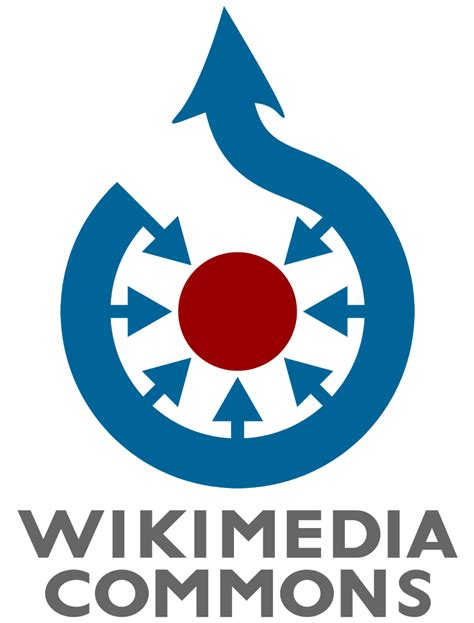

# Free to use? Exploring public domain claims in Wikimedia Commons files sourced from Delpher (May 2025)
Olaf Janssen, xx May 2025

This article is also [available as PDF](ongithub.pdf).

_**[Delpher](https://www.delpher.nl)** offers access to millions of digitized pages from Dutch historical newspapers, books, and magazines — a valuable resource frequently used on Wikimedia Commons. In the first part of this data story, we examine how the Wikimedia community has assigned public domain status to Commons files that have been [sourced from Delpher](https://commons.wikimedia.org/wiki/Category:Media_from_Delpher). In the second part, we explore the validity of these claims and assess whether they align with the actual copyright status of these works._

----------------

Much of the historical content from Delpher falls into the public domain due to its age and can therefore be uploaded to Wikimedia Commons without concern. At the same time, the KB — being the operator of Delpher — has a contractual obligation towards authors and publishers to monitor potential copyright infringements and to prevent them as much as possible, including Delpher content that has been uploaded to Wikimedia Commons.

For this reason, the KB wants to gain a better understanding of which newspaper articles, books, magazines and other materials from Delpher have been uploaded to Wikimedia Commons, and how public domain claims to those files have been assigned by the Wikimedia community. In doing so, it is important to emphasize that the KB has absolutely **no** intention to act as a copyright police force. The goal is to work together with the Wikimedia community to handle copyright matters responsibly, with respect for both creators and users.

## Key figures and findings
The most important key figures and findings of this story are:
* kf 1
* kf 2
* kf 3
* 

### What this article aims to do
1. Provide a **practical case study** of how public domain claims are applied in a real-world environment — specifically, how Wikimedia Commons contributors handle copyright claims for [files sourced from Delpher](https://commons.wikimedia.org/wiki/Category:Media_from_Delpher).
2. Offer insight into the **complexity and messiness** of public domain claims on Wikimedia Commons — even for the relatively simple case where a single source of digitized materials (Delpher) comes from a single country (the Netherlands).
3. Explore **how accurately the Wikimedia community applies public domain claims**, and assess to what extent potential copyright violations may occur — including whether serious violations are present.
4. Share a **practical data story** of how to machine-analyze and visualize copyright claims for files in (subsets of) Wikimedia Commons using data analysis and visualization techniques.  

### What this article does <u>not</u> aim to do
1. Provide a **comprehensive overview of all public domain claims** on Wikimedia Commons. This article focuses specifically on files sourced from Delpher, which is a manageable subset of the total number of files in Commons.
2. Provide a **formal and/or detailed legal analysis** of every public domain claim for these files — such an approach would be far too extensive for the scope of this data story.
3. XXXXXXXXX **Identify and flag every potential copyright infringement** — aside from highlighting a few obvious and illustrative cases mentioned later in this story. XXXXXXXXXXXX (besides the 5 obvious cases mention below)
4. Offer **recommendations or proposals on how to simplify public domain claims** on Wikimedia Commons. This article takes the current public domain landscape "as is," observing how it functions in practice without suggesting reform.

## Copyright and public domain in Wikimedia Commons

Wikimedia Commons is one of the largest open-access media repositories in the world, used daily by Wikipedia and countless other projects. To protect its open and reusable nature, strict rules apply regarding the copyright status of any file uploaded. Contributors must clearly indicate under which legal conditions a file can be shared, reused, or modified. This is done through the use of standardized copyright and licensing templates, which help to ensure clarity and legal compliance across different types of media.

At the core of this system are two key principles that determine whether a file is eligible for inclusion on Wikimedia Commons:

1) Due to the **open nature and reusability** of content on Wikimedia Commons, all uploaded files must either be:  
   **a)** **Out of copyright** — meaning they are in the public domain, either because of age ("passively" in the public domain), or because the rights holder has explicitly released the work into the public domain (e.g., using a **CC0 license**).  
   **b)** **Freely licensed** — under licenses that allow reuse and modification, such as **CC-BY**, **CC-BY-SA**, or similar.

2) **Copyright claims on Wikimedia Commons are expressed through standardized templates.**  
   These templates are meant to ensure **clarity, uniformity, and standardization** when declaring the copyright status of a file.  
   _Example templates include:_  
   - `{{PD-old-70}}` — Public domain because the author died more than 70 years ago.  
   - `{{CC-BY-SA-4.0}}` — Creative Commons Attribution-ShareAlike 4.0 license.  
   - `{{PD-US}}` — Public domain in the United States.

---

### But here’s the problem:  
The number of different copyright and public domain templates is **huge** — easily hundreds. For outsiders, this can feel like navigating a **jungle** of overlapping options and varying terminology, undermining the intended simplicity and standardization.

This complexity is not surprising. Wikimedia Commons accepts media from **any country, any historical period**, and must be able to handle the copyright rules and exceptions of **dozens of legal systems worldwide**.

---

### Focus on Public Domain templates  
Even if we narrow the scope and look **only at public domain templates**, things remain complicated. Many templates are country-specific (reflecting local copyright law), but there’s an important extra layer:

> **Every file on Wikimedia Commons must include a U.S. public domain justification**  
> — because the Commons servers are located in the United States, and U.S. copyright law applies.

This means that for many files, **multiple templates** are required:  
- One (or more) template(s) describing the copyright situation in the **country of origin**;  
- And an additional template confirming the **public domain status in the United States**.

---

### What does this jungle of templates look like?  
Wikimedia Commons uses **hundreds of different public domain templates**, ranging from very general ones like `{{PD-old}}`, to highly specific ones like:  
- `{{PD-EU-anonymous}}` — for anonymous works in the EU.  
- `{{PD-Italy}}` — for works in Italy where copyright has expired.  
- `{{PD-US-expired}}` — for works published in the U.S. before 1929.

_A full overview of these templates is available on the [Commons license template pages](https://commons.wikimedia.org/wiki/Commons:Copyright_tags)._

 *A collage of screenshots of public domain template description pages, as used in Wikimedia Commons [files that have been sourced from Delpher](https://commons.wikimedia.org/wiki/Category:Media_from_Delpher) (Click to enlarge). Image license: <a href="https://creativecommons.org/licenses/by-sa/4.0/deed.nl" target="_blank">CC-BY-SA 4.0</a> / Olaf Janssen, KB national library of the Netherlands.*

## Section 2: Tracking the copyright templates in Wikimedia Commons, for Media from Delpher Delpher
Zoom in on Categortry: Media from Delpher Delpher
Expln how the sxcrit you made helped in trackuing doan all templated that are used in the 62oo files in Cat:media fronm Depher

## Section 3 

<noscript></noscript>

After having done the scan, from the Excel, we could quite ealiy look for opublications that possibly did copyvio, based on the yerar of publication. We looked for files that were published in the last 70 years, and that were not marked as public domain. We found 5 files that were published in the last 70 years, and that were not marked as public domain.
Example of delted file: artiocle in Telgraaf from 1985
In total 5 deletion trequerst due to copyvio, all of which were granted and the fielswere deleted very quicly. 

* https://commons.wikimedia.org/w/index.php?title=File:Newspaper_article_-_De_Telegraaf_-_Date_09-07-1985_-_Bank_robbery_-_Rob_Kaman_-_Kickboxing.jpg&action=edit&redlink=1
* https://commons.wikimedia.org/w/index.php?title=File:Advertentie_Pottenbakkerij_Henk_en_Lieske_Potters_in_Trouw_dd_22_maart_1974.jpg&action=edit&redlink=1
* https://commons.wikimedia.org/w/index.php?title=File:Ad_25_6_1966.jpg&action=edit&redlink=1
* https://commons.wikimedia.org/w/index.php?title=File:Een_oproep_van_Duco_Sickinghe_(1888-1983)_in_dagblad_Het_Binnenhof_en_Het_Vaderland_(1956).jpg&action=edit&redlink=1
* https://commons.wikimedia.org/w/index.php?title=File:Een_oproep_van_Duco_Sickinghe_(1888-1983)_in_dagblad_Het_Binnenhof_en_Het_Vaderland_(1956).jpg&action=edit&redlink=1

><big><b><em>Quote 1</em></b></big>

><big><b><em>Quote 2</em></b></big>

### Section 2.1 

Explan which templates have been found

<noscript></noscript>

<noscript></noscript>

<!-- 
  -->

### Section 2.1 - Zooming in on copyrights expired because of age 

Next., lets';s zoom in on the copyright templates that are used for files that are in the public domain because of age. The blue colors.
 In total theis comprises 24 templates 6191 used in xx distinct files

## Section 3 

## Raw data
All data used for the visualisations and analytics in this article is [available on Github](https://github.com/KBNLwikimedia/xxxx). You can also [download the main Excel file directly](https://kbnlwikimedia.github.io/xxxx.xlsx).

## About the authors

Olaf Janssen is the [Wikimedia coördinator](https://www.kb.nl/over-ons/experts/olaf-janssen) of the KB, the national library of the Netherlands. He contributes to [Wikipedia](https://nl.wikipedia.org/wiki/Wikipedia:GLAM/Koninklijke_Bibliotheek_en_Nationaal_Archief), [Wikimedia Commons](https://commons.wikimedia.org/wiki/Commons:Koninklijke_Bibliotheek) and [Wikidata](https://www.wikidata.org/wiki/Wikidata:GLAM/Koninklijke_Bibliotheek_Nederland) as [User:OlafJanssen](https://commons.wikimedia.org/wiki/User:OlafJanssen). ORCID: [0000-0002-9058-9941](https://orcid.org/0000-0002-9058-9941).

## Reusing this article 
The text and data visualisations of this article have been released under [Creative Commons Attribution](https://creativecommons.org/licenses/by/4.0/deed.en) CC-BY 4.0 license.  

*Citation*: Janssen, O.D. (2025). ‘xxxxxx. [https://doi.org/10.5281/zenodo.xxxx](https://doi.org/10.5281/zenodo.xxxx).  

Attribution: *KB, national library of the Netherlands / Olaf Janssen, CC-BY 4.0*

Raw data: CC0, so released into the public domain. You may freely use, adapt, and redistribute it.

## Identifiers and URLs of this article
Persistent:
* DOI (Zenodo): [https://doi.org/10.5281/zenodo.xxx](https://doi.org/10.5281/zenodo.xxxxx)
* Wikimedia Commons: [https://commons.wikimedia.org/entity/xxxx](https://commons.wikimedia.org/entity/xxxx)

Non-persistent: 
* Github: [https://kbnlwikimedia.github.io/xxxx.html](https://kbnlwikimedia.github.io/xxxxx.html)