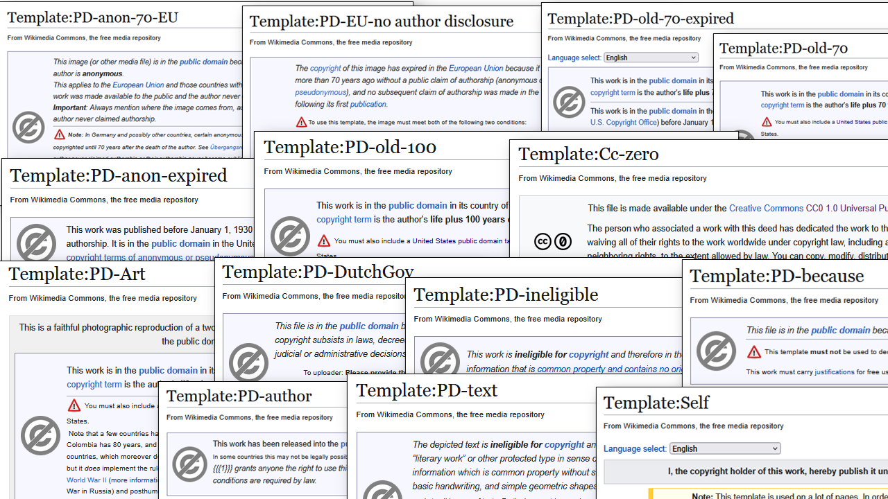

<table width="100%" border="0"><tr><td align="left">
<a href="https://kbnlwikimedia.github.io/stories/"><< Back to stories index</a>
</td><td align="right">
<a href="https://github.com/KBNLwikimedia/wikimedia-commons_copyright-templates" target="_blank">>> To the Github repo of this page</a>
</td></tr></table>

# H1 - Free to use? Exploring public domain claims in Wikimedia Commons files sourced from Delpher (June 2025)
Olaf Janssen, xx June 2025

This article is also [available as PDF](ongithub.pdf).

_**[Delpher](https://www.delpher.nl)** offers access to millions of digitized pages from Dutch historical newspapers, books, and magazines — a valuable resource frequently used on Wikimedia Commons. In the first part of this data story, we examine how the Wikimedia community has assigned public domain status to Commons files that have been [sourced from Delpher](https://commons.wikimedia.org/wiki/Category:Media_from_Delpher).  
In the second part, we explore the validity of these claims and assess whether they align with the actual copyright status of the works. We identify common mistakes made by the Wikimedia community when applying public domain templates to files. Finally, we examine whether these errors have resulted in any serious copyright violations._

## H2 kop -  Key figures and findings
The most important key figures and findings of this story are:
* kf 1
* kf 2
* kf 3
* 

## H2 - Intro, preamble, and background

###  H3 kopje - Why did I write this article? 
Much of the historical content from [Delpher](https://www.delpher.nl) falls into the public domain due to its age and can therefore be uploaded to Wikimedia Commons without concern. At the same time, the KB — being the operator of Delpher — has contractual obligations towards authors and publishers to monitor potential copyright infringements and to prevent them as much as possible. This includes Delpher content that has been uploaded to Wikimedia Commons by Wikimedia contributors.

For this reason, the KB wants to gain a better understanding of which newspaper articles, books, magazines and other materials from Delpher have been uploaded to Wikimedia Commons, and how public domain claims to those files have been assigned by the Wikimedia community. In doing so, it is important to emphasize that the KB has absolutely **no** intention to act as a copyright police force. The goal is to work together with the Wikimedia community to handle copyright matters responsibly, with respect for both creators and users.

###  H3 - What this article aims to do
This article aims to 
1. Provide a **practical case study** of how public domain claims are applied in a real-world open environment — specifically, how Wikimedia Commons contributors handle copyright claims for [files sourced from Delpher](https://commons.wikimedia.org/wiki/Category:Media_from_Delpher).
2. Offer insight into the **complexity of public domain claims** on Wikimedia Commons — even for the relatively simple case where files originate from a single source (Delpher) from a single country (the Netherlands).
3. Explore **how accurately Wikimedia contributors apply public domain claims**, and assess to what extent potential copyright violations may occur — including whether any really serious violations are present.
4. Share a **practical data story** of how to machine-analyze and visualize copyright claims for files in (subsets of) Wikimedia Commons using data analysis and visualization techniques.  

###  H3 - What this article does <u>not</u> aim to do
This article is not trying to  
1. Provide a **comprehensive overview of all public domain claims** on Wikimedia Commons. This article focuses specifically on files sourced from Delpher, which is a manageable subset of the total number of files in Commons.
2. Provide a **formal and/or detailed legal analysis** of every public domain claim for these files — such an approach would be far too deep for the scope of this data story.
3. XXXXXXXXX **Identify and flag every potential copyright infringement** — aside from highlighting a few obvious and illustrative cases mentioned later in this story. XXXXXXXXXXXX (besides the 4 obvious cases mentioned below)
4. Offer **recommendations or proposals on how to simplify public domain claims** on Wikimedia Commons. This article takes the current public domain landscape "as is," observing how it functions in practice without suggesting reform.

###  H3 - Who is this article relevant for? 
This analysis of public domain template usage on Wikimedia Commons applied to files sourced from Delpher may be of interest to:
* **The Wikimedia community** – to gain insights into how (accurately) they have implemented public domain copyright templates, especially for Delpher-sourced files.
* **The Delpher development team and user community** – to better understand how a decentralized, international community of content reusers deals with public domain Delpher-sourced materials in a real-world scenario, i.e. on Wikimedia Commons.
* **Other GLAM institutions with collections on Wikimedia Commons** – to explore how this Delpher case study could be replicated for their own Wikimedia Commons files, supported by the freely available code, data and documentation shared via this article.
* **KB copyright lawyers and the wider legal/copyright community** – to see how copyright law and public domain issues play out in a real-world, open, community-driven environment, and to reflect on the practical implications for heritage institutions like the KB.
* **Rights holders, publishers and collective rights organizations** – to assess whether there should be reasons for serious concern about large-scale copyright violations by the Wikimedia community (*spoiler: our findings suggest there is little to no cause for such concern*).

## H2 - Copyrights templates in Wikimedia Commons

[Wikimedia Commons](https://commons.wikimedia.org/) is one of the largest open-access media repositories in the world, used daily by Wikipedia and countless other businesses and projects. To protect the open and reusable nature of its content, strict legal rules must be followed for files that are uploaded to Commons:  

1) All uploaded files must either be:  
   - Out of copyright — meaning they are in the public domain, either passively [because copyrights have expired](https://gowlingwlg.com/en/insights-resources/articles/2024/public-domain-what-happens-when-copyright-expires), or because the rights holders have waived any copyrights on the files, actively releasing them into the public domain, for instance by using a [CC0 license](https://creativecommons.org/public-domain/cc0/).  
   - Freely licensed — under licenses that allow reuse and modification, most commonly [CC-BY](https://creativecommons.org/licenses/by/4.0/), [CC-BY-SA](https://creativecommons.org/licenses/by-sa/4.0/), or equivalent.

2) These copyright claims must be explicitly and unambiguously added to the file description page.
See for instance the [public domain claim](https://commons.wikimedia.org/w/index.php?title=File:1923_Jos._Schrijnen_%E2%80%94_MMKB02_000118508_00004_image_(cropped).jpg&action=edit&section=2) stated in [this portrait](https://commons.wikimedia.org/wiki/File:1923_Jos._Schrijnen_%E2%80%94_MMKB02_000118508_00004_image_(cropped).jpg) made by the Dutch photograhper [Toni Arens-Tepe](https://nl.wikipedia.org/wiki/Toni_Arens-Tepe) (1883–1947).
 

 *Public domain claim used in the [portrait of Jos. Schrijnen](https://commons.wikimedia.org/wiki/File:1923_Jos._Schrijnen_%E2%80%94_MMKB02_000118508_00004_image_(cropped).jpg#Licensing) on Wikimedia Commons (Click to enlarge). Image license: <a href="https://creativecommons.org/licenses/by-sa/4.0/deed.nl" target="_blank">CC-BY-SA 4.0</a> / Olaf Janssen, KB national library of the Netherlands.*

3) These claims are typically expressed through standardized copyright templates (also known as *license tags*). These templates are meant to ensure clarity, uniformity and standardization when declaring copyright status of files. Templates on Commons can be recognized by the double curly brackets they are called by, for instance 
   - [\{\{PD-old-70\}\}](https://commons.wikimedia.org/wiki/Template:PD-old-70) — The file is in the public domain because the creator of the underlying work died more than 70 years ago.  
   - [\{\{CC-BY-SA-4.0\}\}](https://commons.wikimedia.org/wiki/Template:Cc-by-sa-4.0) — Creative Commons Attribution-ShareAlike 4.0 license.  
   - [\{\{PD-ineligible\}\}](https://commons.wikimedia.org/wiki/Template:PD-ineligible) — The file is in the public domain because it (and/or its underlying work) lacks sufficient originality to be eligible for copyright protection. 

###  H3 - The copyright template jungle   

But here’s the problem: although the purpose of these templates is to provide a clear and standardized way to declare copyright status, the practical reality is that the license tagging system — built over the years by the international Wikimedia community — has evolved into a very complex beast. The number of different copyright templates in use on Commons is enormous.

To get a sense of this complexity, take a look at [this summary of the most common template types](https://commons.wikimedia.org/wiki/Commons:Copyright_tags) or explore this nested [overview of several thousands(!) of copyright templates](https://commons.wikimedia.org/wiki/Category:License_tags) being used on Commons.

Both insiders and outsiders will struggle to find their ways in this system, it can feel like working through a jungle of overlapping licensing options and confusing terminology, undermining the intended simplicity and standardization.

However, this complexity is not entirely surprising. Wikimedia Commons accepts media in many formats (image, document, audio, video etc.) from any country, any jurisdiction and any historical period, and must therefore be able to handle the copyright rules and exceptions from dozens of legal systems worldwide. The elaborate system is necessary because Wikimedia Commons is a global, evolving platform. Templates are regularly added or updated as contributors find new sources for uploads or as local copyright regulations change.

###  H3 - Zooming in: public domain templates
To somewhat trim down this jungle, we can narrow the scope and look only at public domain templates, used for files that are out of copyright. Yet even within this limited scope, things remain complicated, as the number and variety of such templates is still pretty large.

The [general public domain templates](https://commons.wikimedia.org/wiki/Commons:Copyright_tags/General_public_domain) page provides an overview of more than 70 templates based on general criteria, not tied to a specific country or source of the work. The complexity becomes more apparent when examining the [Category:PD license tags](https://commons.wikimedia.org/wiki/Category:PD_license_tags) and its subcategories. These include numerous [country-specific public domain templates](https://commons.wikimedia.org/wiki/Commons:Copyright_tags/Country-specific_tags), each reflecting the legal nuances of copyright legislation in the country of origin.

Adding to this complexity is a crucial requirement: *Every file on Wikimedia Commons must also include a justification for its public domain status under U.S. law.* This requirement arises from the fact that Wikimedia’s servers are located in the United States. Therefore, all hosted content must comply not only with the copyright laws of the country of origin but also with those of the U.S., which [can be particularly intricate](https://guides.library.cornell.edu/copyright/publicdomain) and often differ substantially from other jurisdictions.

In practice, this means that many Commons files require multiple templates: 
* One or more templates describing the copyright status in the country of origin;
* An additional template confirming the file's public domain status in the United States.

###  H3 - Zooming in further: templates used in Delpher files

For the purposes of this article, we aim to narrow the scope even further. We are interested only in public domain copyright templates used for files sourced from [Delpher](https://www.delpher.nl), the Dutch platform providing access to millions of full-text pages from Dutch historical newspapers, books, and magazines. Delpher is a frequently used resource for illustrating Wikipedia articles and for uploads to Wikimedia Commons.

By limiting our focus to this single source, our dataset and analysis become relatively straightforward: we are primarily dealing with materials from one provider (Delpher) and largely from one country (the Netherlands). Nevertheless, as we will explore below, there remains sufficient complexity to make this investigation both meaningful and nuanced.

 *A (non-exhaustive) collage of screenshots of public domain template description pages, as used in Wikimedia Commons [files that have been sourced from Delpher](https://commons.wikimedia.org/wiki/Category:Media_from_Delpher) (Click to enlarge). Image license: <a href="https://creativecommons.org/licenses/by-sa/4.0/deed.nl" target="_blank">CC-BY-SA 4.0</a> / Olaf Janssen, KB national library of the Netherlands.*

## H2 - Creating the dataset

To examine how the Wikimedia community has assigned public domain status to Commons files sourced from Delpher, we first needed a robust and reliable dataset. Let's look at the steps we took to create it.

This community has been uploading newspaper articles, advertisements, obituaries, book pages, portraits from magazines, and other materials from Delpher (and its predecessor projects) to Wikimedia Commons [since March 2008](https://commons.wikimedia.org/wiki/File:Krantenartikel_Tentoonstelling_De_Branding.jpg). Because these files were originally scattered across Commons without consistent categorization, the first step was to bring them together into a single, central place: [Category:Media from Delpher](https://commons.wikimedia.org/wiki/Category:Media_from_Delpher). 
This category currently contains just over over 62K files. 

**Delpher source template** 
We added a [\{\{Delpher\}\} source template](https://commons.wikimedia.org/wiki/Template:Delpher) to all of these files ([example](https://commons.wikimedia.org/w/index.php?title=File:1863_Commissie_tot_de_Vervoermiddelen_op_Java_1863.jpg)). This is not only to visually and textually communicate that Delpher is the source of these files, but also to automatically include the files into the said category. 

 *A screenshot of the rendered [Delpher source template](https://commons.wikimedia.org/wiki/Template:Delpher) on Wikimedia Commons.*

**Excluding scans from the Internet Archive** 
As you can see in the category, a significant part is filled with files claimed to be uploaded from the Internet Archive, but that find their real origins in Delpher. These are the PDFs with *IA ddd ...mpeg21* in their titles ([example](https://commons.wikimedia.org/wiki/File:%27s_Gravenhaagsche_courant_02-09-1822_(IA_ddd_010124645_mpeg21).pdf)). In total there are [55,761 files from the Internet Archive](https://petscan.wmcloud.org/?templates_yes=&ores_prob_from=&search_query=&edits%5Bflagged%5D=both&show_disambiguation_pages=both&common_wiki_other=&wikidata_prop_item_use=&edits%5Banons%5D=both&combination=subset&larger=&min_sitelink_count=&language=commons&manual_list_wiki=&search_max_results=500&edits%5Bbots%5D=both&project=wikimedia&rxp_filter=&negcats=&cb_labels_no_l=1&since_rev0=&sparql=&ores_type=any&links_to_any=&outlinks_no=&sitelinks_yes=&langs_labels_yes=&output_compatability=catscan&sitelinks_no=&categories=Scans_from_the_Internet_Archive%0D%0AMedia+from+Delpher&min_redlink_count=1&interface_language=en&cb_labels_any_l=1&pagepile=&cb_labels_yes_l=1&ores_prob_to=&format=html&wikidata_source_sites=&labels_any=&ns%5B6%5D=1&smaller=&doit) (d.d. 9 April 2025) that were originally sourced from Delpher. 

All of these files are marked with the [\{\{PD-old-70-expired\}\} copyright template](https://commons.wikimedia.org/wiki/Template:PD-old-70-expired), which means that they are safely in the public domain in the Netherlands (and its predecessors), the rest of the EU and the United States. 

Because such a large part - 89.6% of the files - in the [Category:Media from Delpher]((https://commons.wikimedia.org/wiki/Category:Media_from_Delpher)) come from the Internet Archive, we decided to exclude all of them from our further analysis. And because they are marked with the exact same copyright template, including them would make our analysis too biased (or skewed) towards these files and templates.

**Extracting copyright templates** 
This left us with [6,496 'non-Internet Archive' files from Delpher](https://petscan.wmcloud.org/?templates_any=&language=commons&combination=subset&search_max_results=500&langs_labels_yes=&cb_labels_no_l=1&negcats=Scans+from+the+Internet+Archive&format=html&project=wikimedia&cb_labels_yes_l=1&pagepile=&before=20250409&active_tab=tab_pageprops&links_to_all=&min_sitelink_count=&interface_language=en&min_redlink_count=1&only_new=on&ns%5B6%5D=1&sitelinks_any=&categories=Media+from+Delpher&cb_labels_any_l=1&wikidata_source_sites=&rxp_filter=&langs_labels_any=&manual_list_wiki=&doit=). For these files we wanted to detect the associated copyright templates. Assisted by ChatGPT, we developed a (rather monsterous) [Python script](https://github.com/KBNLwikimedia/wikimedia-commons_copyright-templates/blob/main/scripts/extract_copyright_templates.py) to extract public domain or public domain-like (e.g. Creative Commons) license templates . As this script was not 100% perfect, we needed to do some manual post-processing to clean up the data.

**Excluding files without publication/creation dates** 
As we plan to assess the validity of copyright claims against the actual publication or creation dates of the underlying works, we also designed the script to extract simplified date information. Files that provided no publication or creation dates were excluded from further analysis. We will discuss the date extraction process in more detail in SECTIONXXXXXXXXXXXXXXXXXXX.

**Deleting obvious copyright violations**  
After the extraction of templates and associated dates, we did a preliminary scan to identify obvious instances of copyright infringement, which we wanted to exclude from our dataset. Specifically, we examined content published within the last 70 years (post-1955) that were nonetheless marked as public domain or Creative Commons-licensed. This process led to the identification of four copyvio files for which we subsequently submitted deletion requests to Wikimedia Commons administrators: 

1. An article from the Dutch newspaper [De Telegraaf from 1985](https://commons.wikimedia.org/w/index.php?title=File:Newspaper_article_-_De_Telegraaf_-_Date_09-07-1985_-_Bank_robbery_-_Rob_Kaman_-_Kickboxing.jpg), still under copyright, as it was published less than 70 years ago. It cannot have a CC0 license.
2. An article from the Dutch newspaper [Trouw from 1974](https://commons.wikimedia.org/w/index.php?title=File:Advertentie_Pottenbakkerij_Henk_en_Lieske_Potters_in_Trouw_dd_22_maart_1974.jpg). Still under copyright, as it was published less than 70 years ago. We must assume that the copyright is held by the newspaper publisher, unless proven otherwise. 
3. An article from the Dutch newspaper [Algemeen Dagblad from 1966](https://commons.wikimedia.org/w/index.php?title=File:Ad_25_6_1966.jpg). Still under copyright, as it was published less than 70 years ago. We must assume that the copyright is held by the newspaper publisher, unless proven otherwise. Futhermore, it cannot have a CC0 license.
4. The text [Het Binnenhof en Het Vaderland from 1956](https://commons.wikimedia.org/w/index.php?title=File:Een_oproep_van_Duco_Sickinghe_(1888-1983)_in_dagblad_Het_Binnenhof_en_Het_Vaderland_(1956).jpg) by [Duco Wilhelm Sickinghe](https://nl.wikipedia.org/wiki/Duco_Wilhelm_Sickinghe). According to Dutch coppyright law, this article is still under copyright, as the author died in 1983 and the article was published less than 70 years ago. So we must assume that the copyright is still with the (heirs of the) author or with the newspaper publisher, unless proven otherwise. Futhermore, it cannot have a CC-BY license.

All deletion requests were granted immediately and the files were deleted quickly. 

**The final dataset** 
In the end, we were able to retrieve 6,248 distinct files that contained (one or more) copyright templates (6,329 in total), as well as a publication or creation date. This is the [dataset used in our further analysis](link to Excel). XXXXX TODO XXXXXXXX

## H2 - Why are Delpher sourced files in the public domain, according to Wikimedia Commons?

One of the main reasons to write this data story is to gain a better understanding which Delpher-sourced materials have been uploaded to Wikimedia Commons and how public domain claims to those files have been assigned by the Wikimedia community. What insights can be gained from the dataset? 

### H3 - 5 main reasons for public domain classification

For this we first needed to group the copyright templates according to their underlying rationale for placing files in the public domain. This resulted in five distinct main reasons:

1. &nbsp;&nbsp;&nbsp;&nbsp; *Copyrights expired because of age*: This is the most common reason, because the underlying work is too old to carry copyrights. Its digital reproduction (2D scan, photo) is generally also considered to be in the in the public domain. 
Example templates: [\{\{PD-old-70\}\}](https://commons.wikimedia.org/wiki/Template:PD-old-70) or [\{\{PD-old-70-expired\}\}](https://commons.wikimedia.org/wiki/Template:PD-old-70-expired). 

2. &nbsp;&nbsp;&nbsp;&nbsp; *Copyrights waived or made free*: For files that have been released into the public domain or under free licences by their creators or rights holders.  
Example templates: [\{\{CC-zero\}\}](https://commons.wikimedia.org/wiki/Template:Cc-zero) or [\{\{CC-BY-SA-4.0\}\}](https://commons.wikimedia.org/wiki/Template:Cc-by-sa-4.0). 
**Note**: for the readability and flow of this article, we will not make further distinctions between files that were given CC0(-like) templates and the (very limited number of) files that were given CC-BY or CC-BY-SA copyright claims. For the purposes of this article, these are all considered (or 'enforeced') to be parts of the public domain.

3. &nbsp;&nbsp;&nbsp;&nbsp; *Government work, not subject to copyright*: For files that are created by government employees in the course of their official duties, which are not subject to copyright protection in many jurisdictions, including the Netherlands and the United States. 
Example template: [\{\{PD-DutchGov\}\}](https://commons.wikimedia.org/wiki/Template:PD-DutchGov).
   
4. &nbsp;&nbsp;&nbsp;&nbsp; *Not eligible for copyrights due to lack of sufficient originality*: This includes files that are not eligible for copyright protection because they lack sufficient originality, such as simple logos, signatures, or other works that do not meet the threshold for copyrightability. 
Example templates: [\{\{PD-ineligible\}\}](https://commons.wikimedia.org/wiki/Template:PD-ineligible) or [\{\{PD-textlogo\}\}](https://commons.wikimedia.org/wiki/Template:PD-textlogo).
   
5. &nbsp;&nbsp;&nbsp;&nbsp; *Other reasons*: For files that are in the public domain for other reasons, such as being published before the introduction of copyright laws, or because they are not eligible for copyright protection for other reasons. 
Example template: [\{\{PD-because\}\}](https://commons.wikimedia.org/wiki/Template:PD-because).

If we break down the data, we see that our 6,248 files are classified into the public domain by 6,329 templates for the following reasons: 

| Reason for public domain  classification   *(NoCopyrightReason)*                                                                              | Number of template usages | Percentage   |
|---------------------------------------------------------------------------------------------------------------------------------------------------|-------------------------|----------------|
| &nbsp;&nbsp;&nbsp;&nbsp;&nbsp;&nbsp; Copyrights expired because of age                                 | 6,191                       | 97,8%      |
| &nbsp;&nbsp;&nbsp;&nbsp;&nbsp;&nbsp; Copyrights waived or made free                                    | 97                          | 1,5%       |
| &nbsp;&nbsp;&nbsp;&nbsp;&nbsp;&nbsp; Government work, not subject to copyright                         | 20                          | 0,3%       |
| &nbsp;&nbsp;&nbsp;&nbsp;&nbsp;&nbsp; Not eligible for copyrights due to lack of sufficient originality | 18                          | 0,3%       |
| &nbsp;&nbsp;&nbsp;&nbsp;&nbsp;&nbsp; Other reasons                                                           | 3                           | 0,03%      |
| **Total**                                                                                                                                         | **6,329**                   | **100%**   |

These results are also visualized in the donut chart below. For instance, the files in the blue sector use 6,191 templates indicating they are in the public domain because the historical newspapers, books and magazines they were sourced from, are too old to carry copyrights. Please note that a single file can contain multiple out-of-copyright claims, see [this example](https://commons.wikimedia.org/wiki/File:Zoebaida_ad.jpg).

<noscript></noscript>

 

### H3 - 39 distinct public domain claims

Next, let's look in more detail at the templates that are in each of the five categories. It turns out that Delpher-sourced files use a total of 39 distinct templates to communicate their public domain status. These are detailed in the table below, where they are sorted and grouped by the reason why they categorise files into the public domain *(NoCopyrightReason)*. Each group is color-coded for clarity. You can click on the names of the templates in the first column to view their description pages on Wikimedia Commons. 

<noscript></noscript>

**TODO: add static version of this chart for PDF**

### H3 - Usage of public domain templates

We can also look at how often each of the 39 copyright template is used. The bar chart below shows the number of usages for each template, grouped and color-coded by the reason why the files are in the public domain, as explained before. The total number of template usages is 6,329 across 6,248 distinct files. 

We can for instance see that the template [\{\{PD-anon-70-EU\}\}](https://commons.wikimedia.org/wiki/Template:PD-anon-70-EU) is used most frequently, 2,044 times, to indicate copyright has expired in (among others) the EU and the author's identity was never disclosed. The second most used template is [\{\{PD-old-70-expired\}\}](https://commons.wikimedia.org/wiki/Template:PD-old-70-expired), which is used 1,329 times to indicate that the author died more than 70 years ago *and* the work was first published in the US more than 95 years ago.

<noscript></noscript>

<!-- 
  -->

### H3 - Zooming in: copyrights expired because of age 

Let's now zoom in on the blue bars, that is on the copyright templates for files that are in the public domain because of age. This group represents 24 templates, used 6,191 times in 6,114 distinct files.

The table below  shows the number of usages for each template, similar to the previous bar chart. Where possible and applicable, it also lists the specific expiration period(s) implied by the template, as well as any remarks. Copyrights on a work can expire when enough time has passed since
 1. *the author died*: we see values of 100 years (eg. [in Mexico](https://commons.wikimedia.org/wiki/Commons:Copyright_rules_by_territory/Mexico)), 70 years (eg. [in the EU](https://en.wikipedia.org/wiki/Copyright_law_of_the_European_Union)), or N/A because the author's year of death is unknown, or because the author is unknown for anonymous or pseudonymous works. 
 2. *the work was first published*: we see values of 120 years (for collective works), 95 years (eg. [in the US](https://commons.wikimedia.org/wiki/Commons:Copyright_rules_by_territory/United_States)), 70 years (eg. [in the EU](https://en.wikipedia.org/wiki/Copyright_law_of_the_European_Union) for anonymous or pseudonymous works) and 50 or 25 years [in Indonesia](https://commons.wikimedia.org/wiki/Commons:Copyright_rules_by_territory/Indonesia).
 3. *the work was created*: we see values 120 years (if author's death date unknown, or for unpublished US works ) or N/A (for anonymous or pseudonymous works).

Finally, when we look at the remarks column, we can identify groups of templates for anonymous or pseudonymous works, for faithful digital reproductions of 2D public domain artworks, and for Indonesian copyright laws. 

<noscript></noscript>

XXXXXXXXXXXXXXXXXXXXXXXXXXXXXXXXXXXX
XXXXXXXXXXXXXXXXXXXXXXXXXXXXXXXXXXXXXXX
XXXXXXXXXXXXXXXXXXXXXXXXXXXXXXXXXXXXXXX

## H2 kop - Section xx - Compliance of the community to the copyrights statements
Are there any violations of big mistakes?

for the "pd because of age group" (98% of uses) we will look at the year in which the orginal work was published or created (column F "DateOfPublicationOrCreation" in the Excel)

- The years of publication or creation have been extracted from the Wikitext, typically the "Date-field"
- for most files the date could be extracted as a single year, for instance files taken from newspapers that were published in [1863](https://commons.wikimedia.org/wiki/File:1863_03_14_De_Spoorbrug_te_Venlo.jpg), [1926](https://commons.wikimedia.org/wiki/File:Nieuwe_Venlosche_Courant_vol_064_no_185_obituary_m%C3%A8re_Louise_Hanrath.jpg) or [1952](https://commons.wikimedia.org/wiki/File:Portret_van_Eug%C3%A8ne_Brands,_1952.jpg).
- In case this date was not a single year the latest/most recent year has been taken, with a safety margin where possible. For instance [1920s]() *(--> 1930)* , [before 1880]() *(--> 1880)* or [circa 1949]()*(--> 1949)*.  

Interesting cases to study, in the Excel 

### 1. Files from publications published or created in 1955 or later, that are marked as public domain

| File                                                                                                                                                                                                                                                       | Year of publication or creation | License Template |  Copyright Status | Remarks |
|------------------------------------------------------------------------------------------------------------------------------------------------------------------------------------------------------------------------------------------------------------|-----------|----|---------|----|
| [Proclamatie1955-Amigoe.jpg](https://commons.wikimedia.org/wiki/File:Proclamatie1955-Amigoe.jpg)                                                                                                                                                           | 1955 | [PD-anon-70-EU](https://commons.wikimedia.org/wiki/Template:PD-anon-70-EU) | Copyrights expired because of age | aa |
| [1957 Foto-album van burgemeester P.M.J.S. Cremers, 1957 18.jpg](https://commons.wikimedia.org/wiki/File:1957_Foto-album_van_burgemeester_P.M.J.S._Cremers%2C_1957_18.jpg)                                                                                 | 1957 | [Cc-by-4.0](https://commons.wikimedia.org/wiki/Template:Cc-by-4.0) | Copyrights waived or made free | aa |
| [Hindeloopen vlag 1650.svg](https://commons.wikimedia.org/wiki/File:Hindeloopen_vlag_1650.svg)                                                                                                                                                             | 1957 | [PD-self](https://commons.wikimedia.org/wiki/Template:PD-self) | Copyrights waived or made free | aa |
| [Handtekening George van den Bergh.jpg](https://commons.wikimedia.org/wiki/File:Handtekening_George_van_den_Bergh.jpg)                                                                                                                                     | 1960 | [PD-signature](https://commons.wikimedia.org/wiki/Template:PD-signature) | Not eligible for copyrights due to lack of sufficient originality | aa |
| [Expositie van 18 jonge Nederlandse striptekenaars in Kunstcentrum Lijnbaan, 1971.jpg](https://commons.wikimedia.org/wiki/File:Expositie_van_18_jonge_Nederlandse_striptekenaars_in_Kunstcentrum_Lijnbaan%2C_1971.jpg)                                     |  1971 | [Cc-zero](https://commons.wikimedia.org/wiki/Template:Cc-zero) |  Copyrights waived or made free | aa |
| [IJ with two acute accents in Staatsblad van het Koninkrijk der Nederlanden, no. 394, 1996, p. 17.png](https://commons.wikimedia.org/wiki/File:IJ_with_two_acute_accents_in_Staatsblad_van_het_Koninkrijk_der_Nederlanden%2C_no._394%2C_1996%2C_p._17.png) | 1996 | [PD-text](https://commons.wikimedia.org/wiki/Template:PD-text) | Not eligible for copyrights due to lack of sufficient originality | aa |

TODO: Make Datawrapper  for this table

### 2. Files classified "Copyrights waived or made free"

## Section 4: Commonly made mistakes of the community when applying PD templates to Delpher files

Commons mistakes: 
1) fail to include separate template for PD in the US, see for instance [this file](https://commons.wikimedia.org/wiki/File:1923_Jos._Schrijnen_%E2%80%94_MMKB02_000118508_00004_image_(cropped).jpg) that is marked with the [\{\{PD-old-70\}\}](https://commons.wikimedia.org/wiki/Template:PD-old-70) template, but lacks a US-specific template such as [\{\{PD-US-expired\}\}](https://commons.wikimedia.org/wiki/Template:PD-US-expired) template.

## Section 5: Recommendactions to the 
* Wikimedia community to improve the copyright templates and their usage
* Delpher/ KB team
* KB copyright lawyers
* CBO's & publishers 

><big><b><em>Quote 1</em></b></big>

><big><b><em>Quote 2</em></b></big>

## Raw data
All data used for the visualisations and analytics in this article is [available on Github](https://github.com/KBNLwikimedia/xxxx). You can also [download the main Excel file directly](https://kbnlwikimedia.github.io/xxxx.xlsx).

## About the authors

Olaf Janssen is the [Wikimedia coördinator](https://www.kb.nl/over-ons/experts/olaf-janssen) of the KB, the national library of the Netherlands. He contributes to [Wikipedia](https://nl.wikipedia.org/wiki/Wikipedia:GLAM/Koninklijke_Bibliotheek_en_Nationaal_Archief), [Wikimedia Commons](https://commons.wikimedia.org/wiki/Commons:Koninklijke_Bibliotheek) and [Wikidata](https://www.wikidata.org/wiki/Wikidata:GLAM/Koninklijke_Bibliotheek_Nederland) as [User:OlafJanssen](https://commons.wikimedia.org/wiki/User:OlafJanssen). ORCID: [0000-0002-9058-9941](https://orcid.org/0000-0002-9058-9941).

## Reusing this article 
The text and data visualisations of this article have been released under [Creative Commons Attribution](https://creativecommons.org/licenses/by/4.0/deed.en) CC-BY 4.0 license.  

*Citation*: Janssen, O.D. (2025). ‘xxxxxx. [https://doi.org/10.5281/zenodo.xxxx](https://doi.org/10.5281/zenodo.xxxx).  

Attribution: *KB, national library of the Netherlands / Olaf Janssen, CC-BY 4.0*

Raw data: CC0, so released into the public domain. You may freely use, adapt, and redistribute it.

## Identifiers and URLs of this article
Persistent:
* DOI (Zenodo): [https://doi.org/10.5281/zenodo.xxx](https://doi.org/10.5281/zenodo.xxxxx)
* Wikimedia Commons: [https://commons.wikimedia.org/entity/xxxx](https://commons.wikimedia.org/entity/xxxx)

Non-persistent: 
* Github: [https://kbnlwikimedia.github.io/xxxx.html](https://kbnlwikimedia.github.io/xxxxx.html)