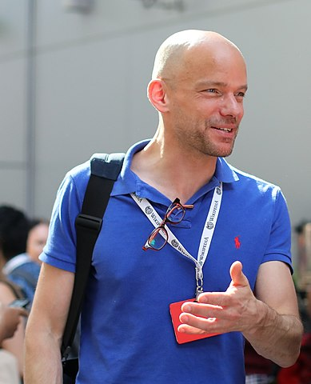

# Story title, May 2025 
Olaf Janssen, xx May 2025

This article is also [available as PDF](ongithub.pdf).

_Summary of story_

><big><b><em>Quote 1</em></b></big>

><big><b><em>Quote 2</em></b></big>

The most important key figures and findings of this story are:
* kf 1
* kf 2
* kf 3
* 

## Section 1 

#### What this story aims to do

#### What this story does NOT aim to do

### Section 1.1 

## Section 2 

### Section 2.1 

<noscript></noscript>

 

## Raw data
All data used for the visualisations and analytics in this article is [available on Github](https://github.com/KBNLwikimedia/xxxx). You can also [download the main Excel file directly](https://kbnlwikimedia.github.io/xxxx.xlsx).

## About the authors

Olaf Janssen is the [Wikimedia coördinator](https://www.kb.nl/over-ons/experts/olaf-janssen) of the KB, the national library of the Netherlands. He contributes to [Wikipedia](https://nl.wikipedia.org/wiki/Wikipedia:GLAM/Koninklijke_Bibliotheek_en_Nationaal_Archief), [Wikimedia Commons](https://commons.wikimedia.org/wiki/Commons:Koninklijke_Bibliotheek) and [Wikidata](https://www.wikidata.org/wiki/Wikidata:GLAM/Koninklijke_Bibliotheek_Nederland) as [User:OlafJanssen](https://commons.wikimedia.org/wiki/User:OlafJanssen). ORCID: [0000-0002-9058-9941](https://orcid.org/0000-0002-9058-9941).

## Reusing this article 
The text and data visualisations of this article have been released under [Creative Commons Attribution](https://creativecommons.org/licenses/by/4.0/deed.en) CC-BY 4.0 license.  

*Citation*: Janssen, O.D. (2025). ‘xxxxxx. [https://doi.org/10.5281/zenodo.xxxx](https://doi.org/10.5281/zenodo.xxxx).  

Attribution: *KB, national library of the Netherlands / Olaf Janssen, CC-BY 4.0*

Raw data: CC0, so released into the public domain. You may freely use, adapt, and redistribute it.

### Identifiers and URLs of this article
Persistent:
* DOI (Zenodo): [https://doi.org/10.5281/zenodo.xxx](https://doi.org/10.5281/zenodo.xxxxx)
* Wikimedia Commons: [https://commons.wikimedia.org/entity/xxxx](https://commons.wikimedia.org/entity/xxxx)

Non-persistent: 
* Github: [https://kbnlwikimedia.github.io/xxxx.html](https://kbnlwikimedia.github.io/xxxxx.html)